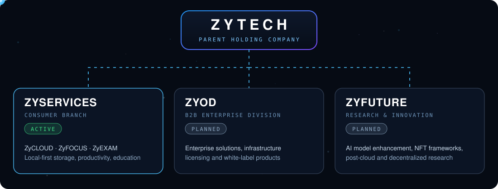
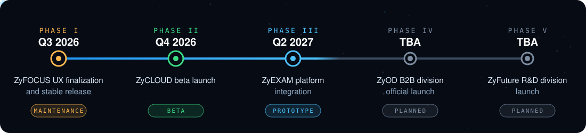

 

 

<table width="100%">
  <tr>
    <td width="170" align="center" valign="middle">
      
    </td>
    <td valign="middle">
      
I'm <b>Zakaria Qasid</b>, 18-year-old founder and CEO of <b>ZyTech</b>, a parent holding company building the next generation of digital infrastructure.

      
Our mission is <b>digital sovereignty</b> and <b>local-first data integrity</b>: modular, high-performance systems where the user stays in full control of their data. From Codecademy to CEO, I build products that put privacy first.

    </td>
  </tr>
</table>

  

 

<table width="100%">
  <tr>
    <td width="33%" align="center"></td>
    <td width="33%" align="center"></td>
    <td width="33%" align="center"></td>
  </tr>
</table>

 

  

 

  

 

| App | Version | Stage | Updated | What's new |
| :---: | :---: | :---: | :---: | :--- |
| **ZyCLOUD** | `—` | Pre-Beta | Jun 2026 | Local storage engine, encryption layer scaffolding |
| **ZyFOCUS** | `v1.5.0` | Active | Jun 2026 | UX overhaul, focus session improvements, bug fixes |
| **ZyEXAM** | `—` | R&D | Jun 2026 | Initial architecture design and module planning |

Updated manually on every release. Full changelogs at <a href="https://zytechg.vercel.app/ceo.html">zytechg.vercel.app</a>

 

 

<table width="100%">
  <tr>
    <td width="50%" valign="top">
      <h3>🚀 Current Role</h3>
      <b>CEO &amp; Founder, ZyTech</b> 
      <i>2025 – Present</i>  
      Leading development of <b>ZyUI</b> and the full <b>ZyServices</b> product suite, and overseeing corporate architecture across all three ZyTech divisions. Specializing in local-first applications built on on-device storage and encryption.
    </td>
    <td width="50%" valign="top">
      <h3>🎓 Education</h3>
      <b>Digital Development Trainee</b>, OFPPT – ISTA NTIC2 Sidi Maârouf 
      <i>2026 – Present</i>  
      <b>Physics &amp; Chemistry</b>, High School El Kindi (Bouskoura) 
      <i>2024 – 2026</i> · Moroccan Baccalaureate, earned while building a company.  
      <b>Full-Stack Development</b>, Codecademy 
      <i>2023 – 2025</i> · Self-taught full-stack engineer.
    </td>
  </tr>
</table>

 

<table width="100%">
  <tr>
    <td width="20%" align="center" valign="top"><h2>⚡</h2><b>Performance First</b> Vanilla JS / HTML / CSS, zero framework overhead</td>
    <td width="20%" align="center" valign="top"><h2>📂</h2><b>Local-First</b> On-device storage before anything touches the wire</td>
    <td width="20%" align="center" valign="top"><h2>🧩</h2><b>Modular Design</b> Reusable components via the ZyUI framework</td>
    <td width="20%" align="center" valign="top"><h2>🔐</h2><b>Privacy by Design</b> Encryption at the architecture level</td>
    <td width="20%" align="center" valign="top"><h2>🏗️</h2><b>Systems Thinking</b> Every decision made across all divisions</td>
  </tr>
</table>

 

  

 

  

  

 

